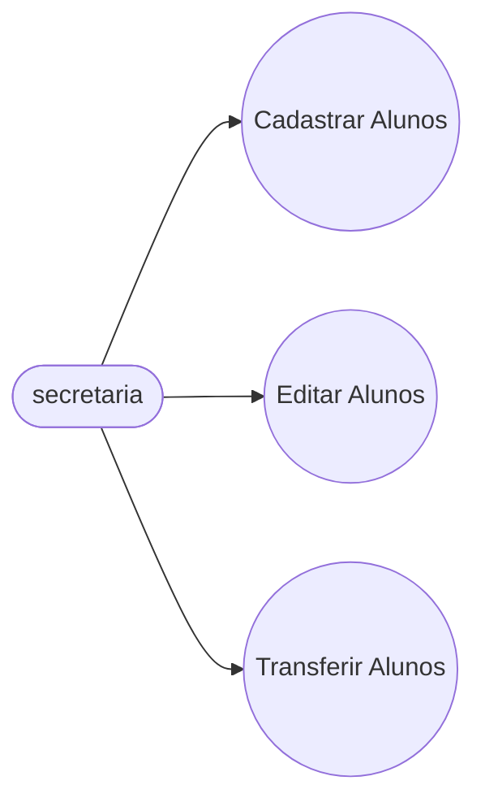
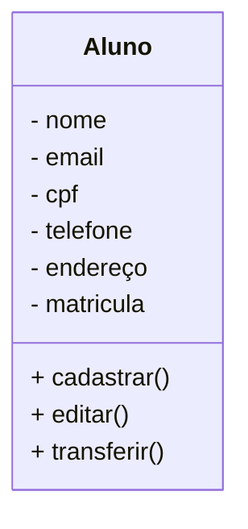
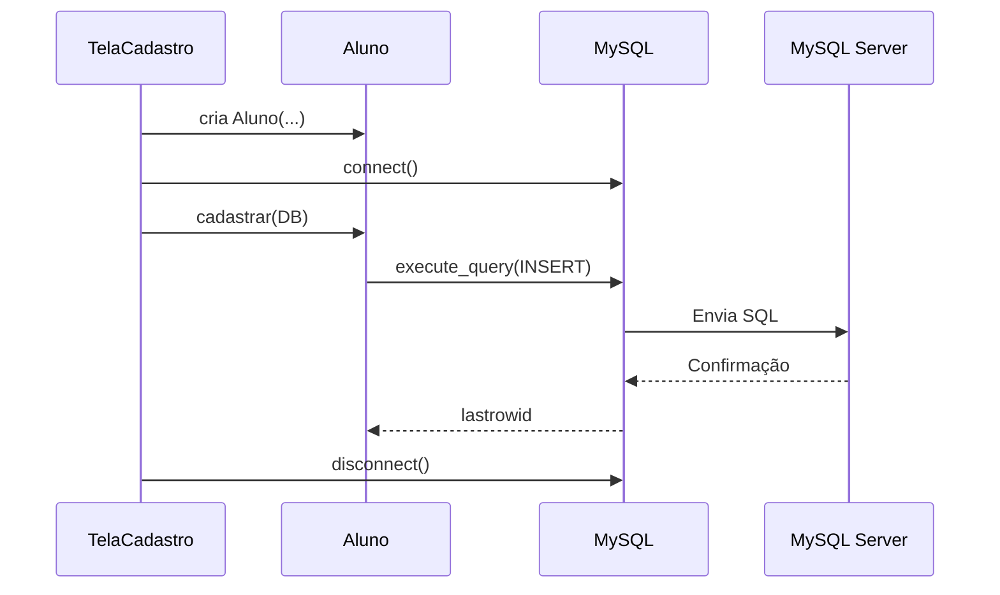
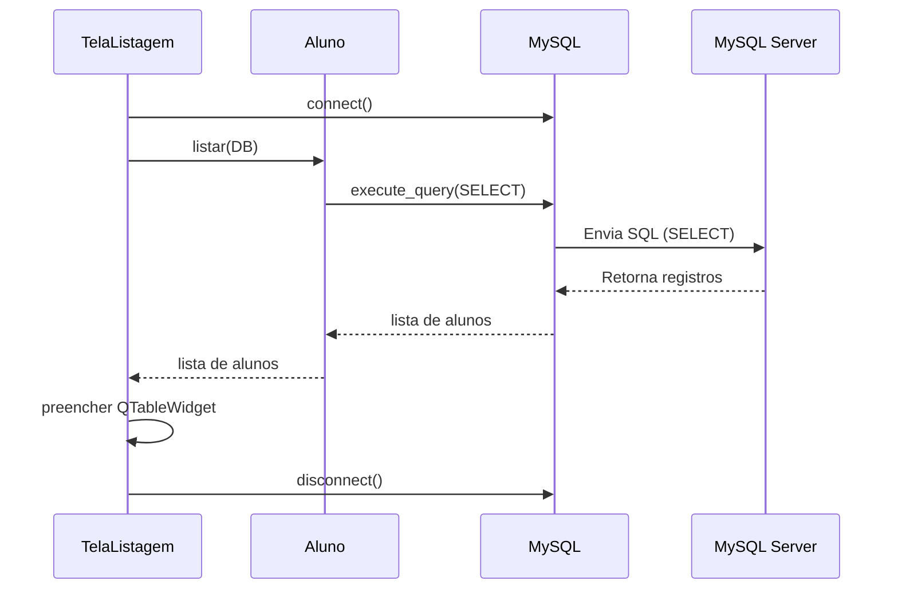

# Projeto Universidade

Modelagem em orientaçao a Objetos das Entidades Alunos, Cursos, e Turmas

# Caso de Uso



## Diagrama de Classes


## Diagrama de Sequência - **Cadastro**

## Diagrama de Sequência - **Listagem**

# Funções MySQL

- CREATE - Cria tabelas dentro da base de dados.
- INSERT - Cria registros dentro das tabelas.

- SELECT - Permite visualizar os dados dentro das tabelas. Também permite filtrar os dados que quer visualizar.

- ALTER - Altera a estrutura das tabelas, adicionando ou removendo atributos(campos).
- UPDATE - Atualiza regristros dentro da tabela.

- DROP - Exclui a tabela ou a base de dados inteira.
- DELETE - Exclui registros dentro das tabelas.

# Conceitos MySQL

- Banco de Dados: Programa hospedado na máquina, com objetivo de persistir os dados fisicamente no HD.

- Base de Dados: Conjunto de tabelas.

- Tabelas: Conjunto de registros.

- Registros: Uma linha na tabela, contendo a informação dos seus atributos.

- Atributos: Uma das caracteristicas da tabela (Colunas).

# Bibliotecas Python

Este é um projeto desktop, utilizando as tecnologias:

- Python
- PySide6
- PyInstaller

## Dependencias
- **VSCode**: IDE (Interface de Desenvolvimento)
- **Mermaid**: Linguagem para Confecçao de Diagramas em Documentos .md (Mark Down)
- **Material icon theme**: tema para Colorir as Pastas.
- **GIt lens**: Interface Grafica para o Versionamento git integrado ao VSCode 
- **MySQL**: SGBD (sistema genrenciador de banco de dados). permite conectar o usuario com o servidor MySql, possibilitando criar base de dados, tabelas, incluir e modificar atributos e registros

## Build
- **Dependências**

- ~~pip install pyinstaller~~
```
pip install -r requirements.txt
```
**Congelar Dependências**
```
pip freeze > requirements.txt
```
**Diretório Raiz do Projeto:** Pasta Python 
```
cd python
```
```
pyinstaller --onefile --windowed app.py
```
**O executável estará em:** dist/app.exe